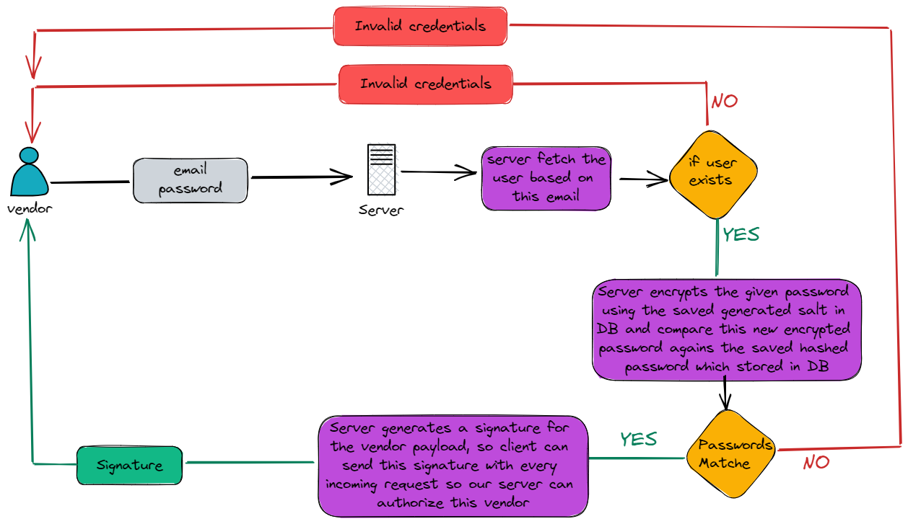
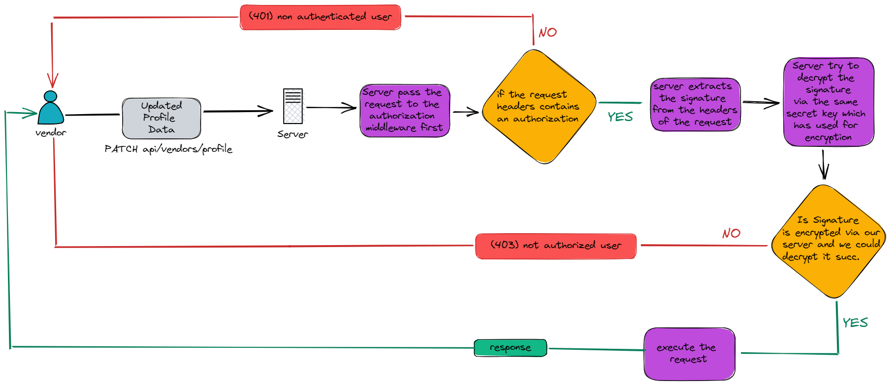

# Food-order-app
This is a backend-side of an online food order delivery application built using the node.js and typescript

# `Feautres` 
➜ Admin can create cendors  
➜ Admin can view all vendors who are registered and functional in the app 
➜ Admin can get specific vendor by the vendor id 

# `Vendor Story`
### ➜ Login Feature

### ➜ Any Request After Login
